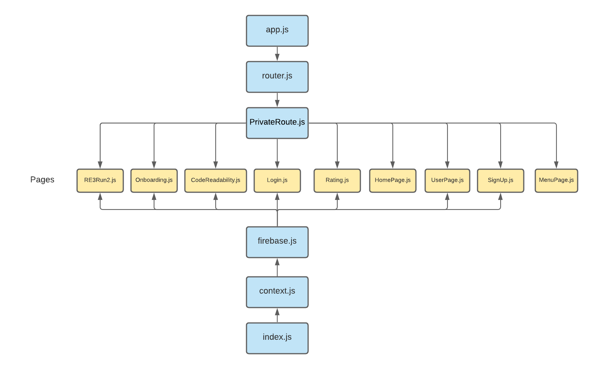

# README_SOFTWARE - RE3 (Reproducibility, Reusability, Readability)

## Access our platform here

[re3.ai](https://re3.ai)

## How to install project from scratch locally and using cloud instances

To open the project on a web browser, follow the following steps:

```
cd 21-05-Re3/re3-client
npm install
npm start
```

To run the flask server that calls our machine learning model:

```
cd Re3-readability/flask_api/app
python3 main.py
```

To build and run projects in a docker container:

```
cd 21-05-Re3/docker-app
source venv/bin/Activate
python3 app.py
celery -A app.celery worker --loglevel=info
redis-cli ping
brew services start redis
```

### Google Cloud Instance / App Engine

In order to deploy the readability model on Google App Engine, you must:

clone the repo into the google cloud shell using:

```
git clone https://github.com/BostonUniversitySeniorDesign/21-05-Re3.git
```

cd into the flask app directory

```
cd Re3-readability/flask_api/app
```

Deploy flask app. The configuration settings are already set up in the app.yaml file.

```
gcloud app deploy
```

### Re3-Readability structure

```
Re3-Readability
├── data
│   ├── data_cleaning
│   │   ├── normalize_ratings.py
│   │   ├── outliers.py
│   │   ├── scale_ratings.py
│   ├── dataverse
│   │   ├── README.md
│   │   ├── dv_scores.csv
│   │   ├── dv_scores_with_vars.csv
│   │   ├── features_and_score.csv
│   │   ├── features_and_score_with_vars.csv
│   │   ├── readability_stats_from_harvard_dataverse.csv
│   │   ├── readability_stats_from_harvard_dataverse2.csv
│   │   ├── score_dv_files.py
│   │   ├── score_dv_files_with_vars.py
│   ├── flask_api/app/
│   │   ├── app.yaml
│   │   ├── get_features.py
│   │   ├── linear_model.sav
│   │   ├── linear_model_avg_assignments.sav
│   │   ├── linear_model_avg_line_len.sav
│   │   ├── linear_model_avg_parentheses.sav
│   │   ├── linear_model_avg_periods.sav
│   │   ├── main.py
│   │   ├── requirements.txt
│   │   ├──
│   ├── models
│   │   ├── binary_model.sav
│   │   ├── linear_model.sav
│   │   ├── linear_model_avg_assignments.sav
│   │   ├── linear_model_avg_line_len.sav
│   │   ├── linear_model_avg_parentheses.sav
│   │   ├── linear_model_avg_periods.sav
│   │   ├──
│   ├── notebooks
│   │   ├── Inter Annotator Agreement.ipynb
│   │   ├── README.md
│   │   ├── Suggestion Box Models.ipynb
│   │   ├── analysis.ipynb
│   │   ├── dataverse_files.ipynb
│   │   ├── feature_correlation.ipynb
│   │   ├── graph_attr.ipynb
│   │   ├── graphs.ipynb
│   ├── src
│   │   ├── buse-readability-snippets
│   │   ├── data fetching
│   │   │   ├── fetch_ratings.py
│   │   │   ├── fetch_user_attr.py
│   │   │   ├── organize_features.py
│   ├── .gitignore
│   ├── README.md
│   ├── conda_env.yml
│   ├── re3_updated_depencies.yml
│   ├── requirements.txt
```

- data/data_cleaning/outliers.py: code to remove outliers from survey ratings into a new csv.
- data/data_cleaning/scale_ratings.py: code to scale survey ratings from 1-5 into a new csv.
- data/data_cleaning/normalize_ratings.py: code to normalize ratings to 1-10 into a new csv.
- data/dataverse/score_dv_files.py: run ml model on over 1000+ real world code examples.
- data/dataverse/score_dv_files_with_vars.py: run ml model on over 1000+ real world code examples.
- flask_api/app/get_features.py: Parse code file for structural features.
- flask_api/app/main.py: flask server that calls our machine learning model on user uploaded code.
- notebooks/Inter Annotator Agreement.ipynb - script to visualize agreement between survey participants.
- notebooks/ Suggestion Box Models.ipynb - code to generate models for code improvement suggestions.
- notebooks/analysis.ipynb - code to generate models for code readability scores.
- notebooks/dataverse_files.ipynb - visualize readability scores from 1000+ real-world code examples from harvard dataverse.
- notebooks/feature_correlation.ipynb - code to find which features have the greatest impact on our machine learning model.
- notebooks/graph_attr.ipynb - visualize user demographics.
- notebooks/graphs.ipynb - visualize survey ratings from code readability survey.
- src/data fetching/fetch_ratings.py: code to fetch survey ratings from firestore
- src/data fetching/fetch_user_attr.py: code to fetch user demographics from firestore
- src/data fetching/organize_features.py: code to organize code features into a csv.
- src/get_readability_stats/readability-snippets-r/readability_analysis_with_vars.py: code to parse file for structural features.
- src/get_readability_stats/readability-snippets-r/readability_analysis.py: code to parse file for structural features.
- src/get_readability_stats/readability-snippets-r/tests_with_vars.py: unit tests to test code parser
- src/get_readability_stats/readability-snippets-r/tests.py: unit tests to test code parser

### Readability model dependencies

```
certifi==2020.12.5
chardet==4.0.0
click==7.1.2
Flask==1.1.2
Flask-Cors==3.0.10
gunicorn==20.0.4
idna==2.10
itsdangerous==1.1.0
Jinja2==2.11.3
joblib==1.0.1
MarkupSafe==1.1.1
numpy==1.19.5
requests==2.25.1
scikit-learn==0.24.1
scipy==1.5.4
six==1.15.0
sklearn==0.0
threadpoolctl==2.1.0
urllib3==1.26.4
Werkzeug==1.0.1
appnope==0.1.2
backcall==0.2.0
cycler==0.10.0
decorator==4.4.2
ipykernel==5.4.3
ipython==7.19.0
ipython-genutils==0.2.0
jedi==0.18.0
joblib==1.0.0
jupyter-client==6.1.11
jupyter-core==4.7.0
kiwisolver==1.3.1
matplotlib==3.3.4
numpy==1.19.5
pandas==1.2.1
parso==0.8.1
pexpect==4.8.0
pickleshare==0.7.5
Pillow==8.1.0
prompt-toolkit==3.0.14
ptyprocess==0.7.0
Pygments==2.7.4
pyparsing==2.4.7
python-dateutil==2.8.1
pytz==2020.5
pyzmq==22.0.2
scikit-learn==0.24.1
scipy==1.6.0
seaborn==0.11.1
six==1.15.0
sklearn==0.0
threadpoolctl==2.1.0
tornado==6.1
traitlets==5.0.5
wcwidth==0.2.5
```

### re3-client structure

- Node Version: v17.0.2

```
re3-client
.
├── README.md
├── package-lock.json
├── package.json
├── public
│   ├── favicon.ico
│   ├── index.html
│   ├── logo192.png
│   ├── logo512.png
│   ├── manifest.json
│   └── robots.txt
├── src
│   ├── App.css
│   ├── App.js
│   ├── App.test.js
│   ├── assets
│   │   ├── css
│   │   │   └── spinner.css
│   │   └── img
│   │       ├── LOGO.png
│   │       ├── LOGO2.png
│   │       ├── LOGO3.png
│   │       ├── Re3Logo.png
│   │       ├── data.svg
│   │       ├── maybe.jpg
│   ├── components
│   │   ├── Card.js
│   │   ├── ColorBar.js
│   │   ├── DisplayFileSmaller.js
│   │   ├── DisplayLogs.js
│   │   ├── DragAndDrop.js
│   │   ├── DropDown.js
│   │   ├── HeaderBestPractices.js
│   │   ├── HeaderHomePageButton.js
│   │   ├── HeaderLoginButton1.js
│   │   ├── HeaderSignUpButton.js
│   │   ├── HomePageHeader.js
│   │   ├── Logo.js
│   │   ├── MenuDropDown.js
│   │   ├── MyAccountButton.js
│   │   ├── MyInput.js
│   │   ├── NextButton.js
│   │   ├── Onboarding.js
│   │   ├── OnboardingHeader.js
│   │   ├── OnboardingOption.js
│   │   ├── PopUpButton.js
│   │   ├── PrivateRoute.js
│   │   ├── ProgressBar.js
│   │   ├── RatingHeader.js
│   │   ├── RatingNumberButton.js
│   │   ├── SignInButton.js
│   │   ├── SignOutButton.js
│   │   ├── SignUpHeader.js
│   │   ├── SimpleHeader.js
│   │   ├── Spinner.js
│   │   ├── TestDisplayFile.js
│   │   ├── TestDownloadFile.js
│   │   ├── TextInput.js
│   │   ├── Transition.js
│   │   └── UploadButton.js
│   ├── data
│   │   └── r-versions.js
│   ├── firebase
│   │   ├── auth.js
│   │   ├── context.js
│   │   ├── firebase.js
│   │   └── index.js
│   ├── index.css
│   ├── index.js
│   ├── logo.svg
│   ├── pages
│   │   ├── BestPractices.js
│   │   ├── CodeReadability.js
│   │   ├── Dashboard.js
│   │   ├── HomePage.js
│   │   ├── HomePage2.js
│   │   ├── Loading.js
│   │   ├── Login.js
│   │   ├── MenuPage.js
│   │   ├── NotFound.js
│   │   ├── Onboarding.js
│   │   ├── RE3Run.js
│   │   ├── RE3Run2.js
│   │   ├── Rating.js
│   │   ├── ReproducabilityInit.js
│   │   ├── ReproducabilityOptionsPage.js
│   │   ├── SignUp.js
│   │   ├── Transition.js
│   │   ├── Transition2.js
│   │   └── UserPage.js
│   ├── reportWebVitals.js
│   ├── setupTests.js
│   ├── tailwind.css
│   ├── tailwind.output.css
│   └── utils
│       └── Router.js
├── tailwind.config.js
└── yarn.lock

```

- index.html : The main HTML file, the entire app gets appended to the element in this file
- svg : This folder contains the animated pictures we used in our project to make it visually more appealing
- README.md : This file contains the overview of the entire project including the reproducibility and readability aspects of the project
- App.js : The parent file for the application that defines the routing
- App.css : The parent file for the application that defines the styling of the entire app
- spinner.css : this file contains the CSS Loader
- DisplayLogs.js : It contains the logic to format the build and run logs
- DragAndDrop.js : The UI includes the component that lets the user order the files that were uploaded, this module takes care of that.
- DropDown.js : This file contains the logic that is required for the drop down menu that displays the R version.
- HeaderHomePageButton.js : Its a button that takes a user to the home page
- HeaderSignUpButton.js : This takes the user to the sign up page
- TestDisplayFile.js : For displaying the code snippet the formatting is handled by this file
- Dashboard.js : The page that contains the survey
- Onboarding.js : The page that is shown to the user when he/she log in for the first time
- RE3Run2.js : This page contains the logic that displayed to user when he/she submits a project to the reproducibility platform
- tailwind.css : contains the styling features used in our project.
- Router.js : It handles the routing of all pages

#### Code Flow Diagram



## docker-app structure

```
.
├── Dockerfile
├── ReproducibilityProjects
│   ├── Dependencies.txt
│   ├── Project3
│   │   ├── Brader_et_al2008.RData
│   │   ├── README.txt
│   │   ├── table1.csv
│   │   └── zhou-wodtke_cde_example.R
│   ├── project1
│   │   ├── CottrellLSQreplication.R
│   │   ├── CottrellLSQreplication.Rdata
│   │   ├── Readme.txt
│   │   └── datadictionary.docx
│   └── project2
│       ├── readme.txt
│       ├── study1.R
│       ├── study1_data.csv
│       ├── study2.R
│       ├── study2_data.csv
│       ├── study3.R
│       └── study3_data.csv
├── __pycache__
├── app.py
├── cloudbuild.yaml
├── execute_files.py
├── file_util.py
├── get_and_exec.py
├── procfile
├── python-app.conf
├── requirements.txt
└── run_workflow.sh

```

- Dockerfile: template Dockerfile used for reproducibility projects. Arguments are passed to this file and used to build images for the user’s projects
  app.py: this is the main file driving the Flask application. This Flask application is hosted in a Kubernetes cluster in its own pod.
- cloudbuild.yaml: this file specifies configurations for Cloud Build processes. For example, it specifies where to store container images in our artifact registry once images finish building.
- execute_files.py: this is a helper file that has a function that can execute R files using subprocess calls. This file exists in all user project containers and is used inside of Kubernetes jobs when users run projects.
- file_util.py: another helper file that has functions that are used to pull user uploaded files into running Kubernetes jobs so they can be executed
- get_and_exec.py: the main python script that is executed inside of the Kubernetes jobs that pulls user files from file storage and executes them using exexcute_files.py
- run_workflow.sh: entrypoint file inside of user project images

#### Reproducibility Architecture Diagram


## Contributors

- [Andreas Francisco De Melo Oliveira](https://github.com/andoliv1)
- [Ethan Hung](https://github.com/ehungbu)
- [Jyotsna Penumaka](https://github.com/jyotsna-penumaka)
- [Layan Bahaidarah](https://github.com/layanb98)
- [Lukas Rosario](https://github.com/lukasrosario)
- [Ana Trisovic](https://github.com/atrisovic)
